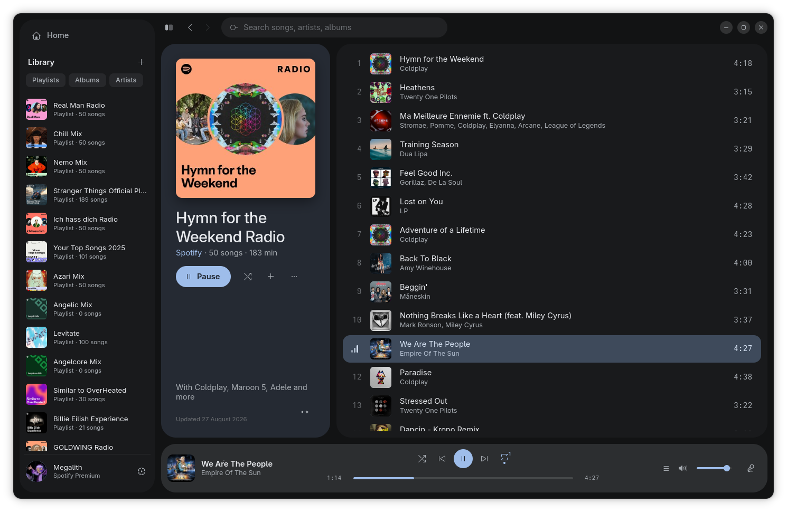

# gatefold

A Spotify client built on GTK4 and librespot, designed around the album art.
Needs a Spotify Premium account.



The goal is feature parity with the official client. Where it stands:

### Playback

- [x] Play, pause, seek, skip, shuffle, repeat
- [x] Volume
- [x] Gapless playback
- [x] Queue, play next, add to queue
- [ ] Smart Shuffle
- [ ] Crossfade
- [ ] Mix: automatic and custom transitions in playlists
- [ ] Volume normalisation
- [ ] Audio quality
- [ ] Equalizer
- [ ] Spotify Connect
- [ ] MPRIS and media keys
- [ ] Mini player
- [ ] Full-screen now playing

### Browse

- [x] Search
- [x] Album and playlist pages
- [x] Artist pages, discography, related artists
- [x] Synced lyrics, word by word where available
- [ ] Home and recommendations
- [ ] Genres and moods
- [ ] New releases and charts
- [ ] Song and artist radio
- [ ] Recently played
- [ ] Podcasts and audiobooks
- [ ] Song credits
- [ ] Canvas

### Library

- [x] Playlists, albums, artists
- [ ] Liked songs
- [ ] Saving albums and following artists
- [ ] Creating and editing playlists
- [ ] Playlist folders
- [ ] Collaborative playlists
- [ ] Sorting and filtering
- [ ] Local files
- [ ] Offline downloads

### App

- [x] Colours taken from the cover
- [x] Stays signed in
- [ ] Multiple accounts
- [ ] Settings
- [ ] Private session
- [ ] Explicit content filter
- [ ] Android

## Building

You need Rust 1.88 or newer, GTK 4.22 and libadwaita 1.9.

```sh
# Arch
sudo pacman -S gtk4 libadwaita alsa-lib openssl pkgconf
# Fedora
sudo dnf install gtk4-devel libadwaita-devel alsa-lib-devel openssl-devel pkgconf
# macOS
brew install gtk4 libadwaita pkgconf
# Windows, from an MSYS2 UCRT64 shell
pacman -S mingw-w64-ucrt-x86_64-gtk4 mingw-w64-ucrt-x86_64-libadwaita mingw-w64-ucrt-x86_64-rust
```

```sh
cargo run --release
```

On Linux, `just install` puts the binary, desktop file and icon under
`~/.local` (or `$PREFIX`).

## Signing in

Sign in with your Spotify account on first launch. Credentials are cached in
`~/.cache/gatefold`.

Search and the library go through Spotify's Web API with librespot's default
client ID. To use your own, set `GATEFOLD_CLIENT_ID` or write it to
`~/.config/gatefold/client_id`.

## License

GPL-3.0-or-later.
